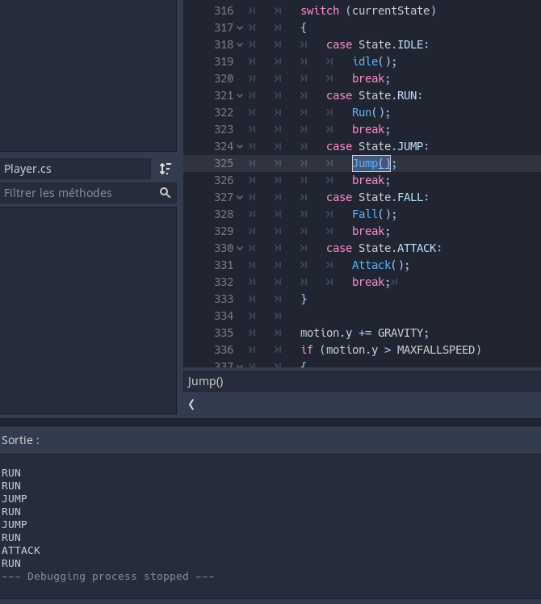

# Skeleton Attack
Olivier Lefebvre
## Introduction
Ce jeu est un jeu de plateforme 2D où le héro devra se défendre contre une ordre de squelette dans deux niveau différent, un étant complètement dans le noir sauf un rond a l'entours du joueur afin que le joueur puisse voir les ennemies seulement dans ce champ et l'autre ayant une spawner de monstres dans le haut du niveau pour rencontrer des monstres tout au long du parcours du joueur. Le joueur devra tuer des squelette afin d'avoir **un score égale ou supérieur a 5** afin de gagner la partie.

## Le Parallax Background ou Défilement de parallaxe
ce concept intégré a Godot permet la gestion de l'arrière plan afin que plusieurs couche soit afficher et que celles-ci avancent a différente vitesse pendant la partie. ce concept permet également de créer un illusion de profondeur a l'arrière-plan

<table>
    <tr>
        <td>
            <figure>
                
                <figcaption>liste des couchent utiliser dans le parallax. Ces couchent sont des ParallaxLayer aux quelles sont attachés un sprite</figcaption>
            </figure>
        </td>  
        <td>  
            <figure>
                
                <figcaption>parallax final avec toutes les couchent supperposées</figcaption>
            </figure>
        </td>
    </tr>
</table>

Pour effectuer ce concept, je me suis inspiré des notes de cours de notre professeur Nicolas : https://cshawi-my.sharepoint.com/:p:/g/personal/nbourre_cshawi_ca/EaAmN5-Ik35OpyZFpZZq5u8BdAaPWGQkXiLsZ2-wIhElhQ?e=UtglSq

## State Machine ou La machine à états finis
Ce concept permet d'avoir un code beaucoup plus facile a lire sans avoir des if a répétition. Ce concept nous permet de gérer facilement les états de notre personnage qui sont au préalable dans un enum. Lorsque nous voulons que notre personnage saute ou cours tout juste après un voir attaquer il suffit simplement de changer l'état pour que celle-ci ce change dans la switch par exemple.
**
<table>
    <tr>
        <td>
            <figure>
                
                <figcaption>Switch de state ansi que le changement d'état afficher en console</figcaption>
            </figure>
        </td>  
    </tr>
</table>

Pour effectuer ce concept, je me suis inspiré des notes de cours de notre professeur Nicolas : https://docs.google.com/presentation/d/1spE-ETEnnZquTMeOgCaZRPmHi46JVmVQgUN-XiN3pdg/edit#slide=id.g18e9bb5ccf_0_62