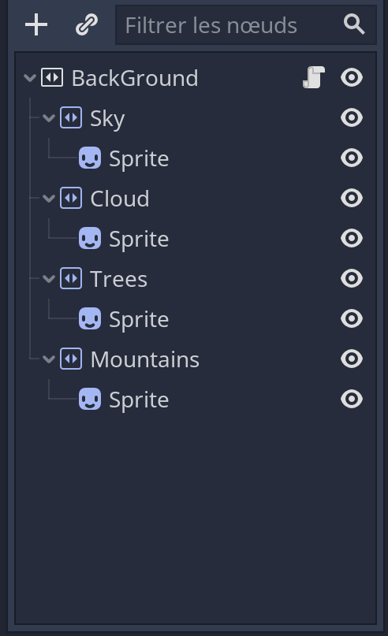
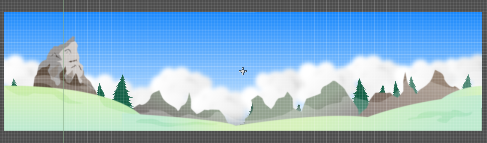

# Skeleton Attack
Olivier Lefebvre
## Introduction
Ce jeu est un jeu de plateforme 2D où le héro devra se défendre contre une ordre de squelette dans deux niveau différent, un étant complètement dans le noir sauf un rond a l'entours du joueur afin que le joueur puisse voir les ennemies seulement dans ce champ et l'autre ayant une spawner de monstres dans le haut du niveau pour rencontrer des monstres tout au long du parcours du joueur. Le joueur devra tuer des squelette afin d'avoir **un score égale ou supérieur a 5** afin de gagner la partie.

## Le Parallax Background
ce concept intégré a Godot permet la gestion de l'arrière plan afin que plusieurs couche soit afficher et que celles-ci avancent a différente vitesse pendant la partie.

<table>
    <tr>
        <td>
            <figure>
                
                <figcaption>liste des couchent utiliser dans le parallax. Ces couchent sont des ParallaxLayer aux quelles sont attachés un sprite</figcaption>
            </figure>
        </td>  
        <td>  
            <figure>
                
                <figcaption>parallax final avec toutes les couchent supperposées</figcaption>
            </figure>
        </td>
    </tr>
</table>

Pour effectuer ce concept, je me suis inspiré des notes de cours de notre professeur Nicolas : https://cshawi-my.sharepoint.com/:p:/g/personal/nbourre_cshawi_ca/EaAmN5-Ik35OpyZFpZZq5u8BdAaPWGQkXiLsZ2-wIhElhQ?e=UtglSq

## Le Parallax Background
